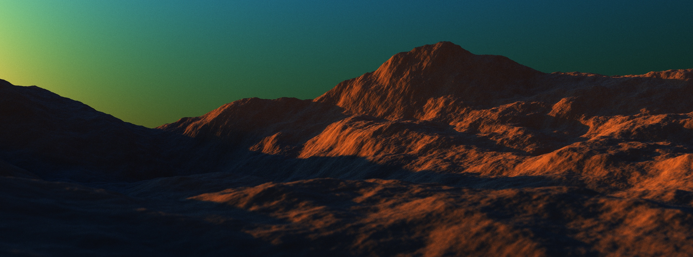

# OBVHS - BVH Construction and Traversal Library

- [PLOC](https://meistdan.github.io/publications/ploc/paper.pdf) BVH2 builder with [Parallel Reinsertion](https://meistdan.github.io/publications/prbvh/paper.pdf) and spatial pre-splits.
- [CWBVH](https://research.nvidia.com/sites/default/files/publications/ylitie2017hpg-paper.pdf) An eight-way compressed wide BVH8 builder. Each BVH Node is compressed so that it takes up only 80 bytes per node.
- CPU traversal for both BVH2 and CWBVH (SIMD traversal, intersecting 4 nodes at a time)
- For GPU traversal example, see the [Tray Racing](https://github.com/DGriffin91/tray_racing) benchmark

[*demoscene example*](https://github.com/DGriffin91/obvhs/blob/main/examples/demoscene.rs)

OBVHS optionally uses [rayon](https://github.com/rayon-rs/rayon) to parallelize building. Many parts of the building process are parallelized, but single threaded building speed has initally been the priority so there is still quite a bit of room for improvement in parallel building performance.

# Benchmarks
See [Tray Racing](https://github.com/DGriffin91/tray_racing).

# Acknowledgments
- [Tomasz Stachowiak](https://github.com/h3r2tic) for the initial rust/embree CWBVH builder, HLSL traversal, and numerous discussions along the way.
- Jan Van Bergen for their [wonderful CUDA path tracer that implements CWBVH](https://github.com/jan-van-bergen/GPU-Raytracer).
- Arsène Pérard-Gayot for their [series of articles on BVHs](https://madmann91.github.io/) and [BVH library](https://github.com/madmann91/bvh).
- H. Ylitie et al. for [Efficient Incoherent Ray Traversal on GPUs Through
Compressed Wide BVHs](https://research.nvidia.com/sites/default/files/publications/ylitie2017hpg-paper.pdf).
- D. Meister et al. for [Parallel Locally-Ordered Clustering for Bounding Volume Hierarchy Construction](https://meistdan.github.io/publications/ploc/paper.pdf), [Parallel Reinsertion for Bounding Volume Hierarchy Optimization](https://meistdan.github.io/publications/prbvh/paper.pdf), and [Performance Comparison of Bounding Volume Hierarchies for GPU Ray Tracing](https://jcgt.org/published/0011/04/01/paper.pdf).
